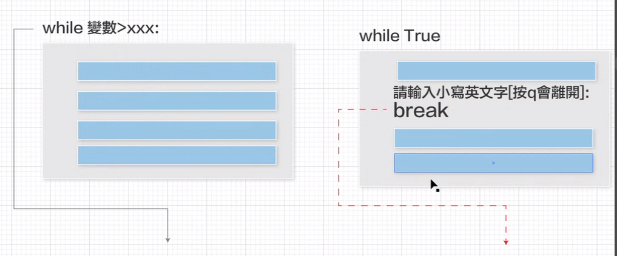

### 迴圈
[內建函數range](https://docs.python.org/zh-tw/3/library/functions.html#func-range)

`class range(stop)`

`class range(start, stop, step=1)`
`range(0,10)`
- 列出一個0~10的序列

`start=開始、stop=停止、step=1＞每次間隔為1 如果沒特別寫就是1`
- 意思是，一段程式你要他重複執行多少次？(為甚麼要重複等等會講)
- 分成兩種情形
    - 明確知道要執行多少次 要用for (自訂變數) in (串列型別)
        - 串列型別=資料類型
        - for in 兩者之間可以放置使用者自訂的變數
        - in後則可接一個序列 (Sequence)，串列 (list)、字串 (str)、元組 (tuple) 

    - 不明確知道要執行幾次 要用while boolean (比較運算子or邏輯運算子)

- print()函式內有內建的結尾end='\n' ＞會有換行效果，這是特殊的字串

### 迴圈中的迴圈(外部&內部迴圈，在for裡面再放for)

### 格式迷你語言
- 如果要格式，先打一個:再設定
- 可以使用 > ^ < 這三種符號以及數值來搭配佔位及對齊。注意: 數值型別預設是靠右對齊，字串型別預設是靠左對齊
- {:>8d}      : 整數靠右對齊，寬度為 8
- {:^8d}      : 整數置中對齊，寬度為 8
- {:<8d}      : 整數靠左對齊，寬度為 8
- {:8.3f}     : 小數點後保留 3 位，總寬度為 8 (含小數點)
- {:+8.3f}    : 小數點後保留 3 位，帶正負號，總寬度為 8 (含小數點及正負號)

[格式字符串语法](https://docs.python.org/zh-tw/3/library/string.html?highlight=%E8%BF%B7%E4%BD%A0)

### - 不明確知道要執行幾次的迴圈 要用while boolean (比較運算子or邏輯運算子)
- 進入&跳出迴圈都看 while 後面是true or false
- 會有bool的情形：比較&邏輯運算子、not運算子
    1. 迴圈外面建立一個變數
    2. 比較變數(得出結果是true oe false)
        - 如果只有寫這兩步，就是無限迴圈
    3. 改變變數值，才有可能讓whle後面變成false＞結束迴圈

### 進階－如果我的變數值不固定，我就不能確定他哪天會停止了

### not
- not = 不是的意思，調換程式區塊的順序會經常使用到
- 如果我要先執行false的程式區塊，就要顛倒是非
- not true = false
- not false = true 

[not運算子](https://shengyu7697.github.io/python-not/)

### while break 跳出迴圈 很常用喔
- 強迫while迴圈結束的關鍵字
- 比變數那個更靈活
    - 原本跳出迴圈的地方只有while後面判斷T&F的地方
    - 程式碼只有全部執行or全部不執行的選擇

### continue 也是跳出迴圈，但是跳到下一輪迴圈
- 底下都不用執行了，跳到下一輪的迴圈由上而下開始輸入
- 用法比break有水準
- 要注意階層問題

### random 函式運用
## 生成偽隨機數
[官方說明書](https://docs.python.org/zh-tw/3/library/random.html?highlight=randint)
- random.randint(a, b)
    - 隨機生成一個介於a跟b之間的整數
- 