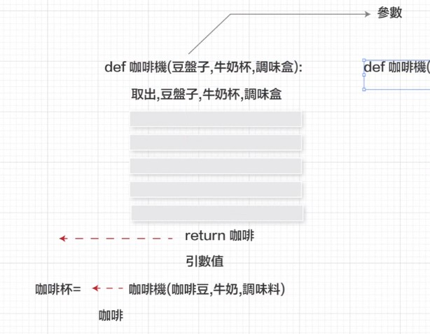

## 自訂函式(funcition def)
- 原本python有內建函式，規則已經定義好了，我們只要依照他的規則呼叫函式即可
- 要清楚知道這些內建函式屬於哪裡，可以快速找到使用說明書(e.g. Random module模組裡面大概有七十幾種函式)

### 變數命名法(為了比較好辨別)
- 駝峰式命名法 sayHello
- 用底線say_hello

### 甚麼時候用的到？自訂函式 def return用法
- 函式是預先寫好的程式碼，等我們呼叫的時候才會運算
- 如果需要多次複製、貼上、修改同一個程式片段變數名稱時 可以考慮使用定義函式 

### 為何要自訂fuction？
1. 簡化主程式
2. 可以重複呼叫
3. 簡化複雜邏輯思考

- 自訂fuction的步驟
    1. 定義一個function
        - def 名稱(參數)：
        - 定義變數：只有在自訂fuction裡面的變數式區域變數(其他for、if都是全域變數)
    2. 呼叫fuction(啟動)
        - 輸入引數值回去呼叫參數

- def 函式名稱（參數名稱） >定義函式（函式參數）
- 這個函式內的程式碼       >函式內有什麼
- return                   >回傳值

### return 回傳值
- 因為函式呼叫後還要做更多運算
- 把函式的內容直接覆蓋掉原先呼叫的內容
- 函式執行遇到return後 會直接結束

- print 會自動印出所有程式運算的結果
- 所以print遇到def時，如果沒有設定return
- 會自動預設 return＝None (什麼都不是>結束函式)

```
def hiAlvis():  # 定義一個叫hiAlvis的函式
    print("hi") # 裡面是印出hi字串
```
```
python 3.10之後的版本可以加資料類型說明
def咖啡機(豆盤子:咖啡豆, 牛奶杯:牛奶, 調味盒:糖)
```
