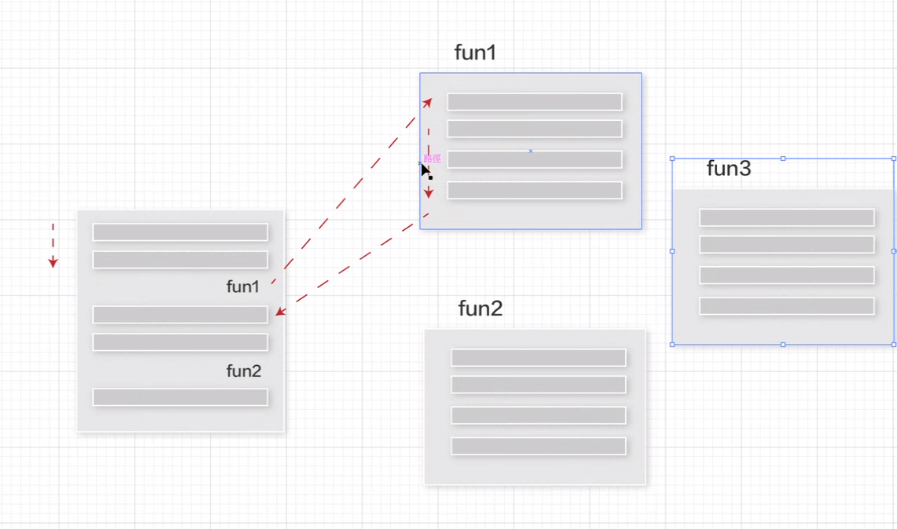
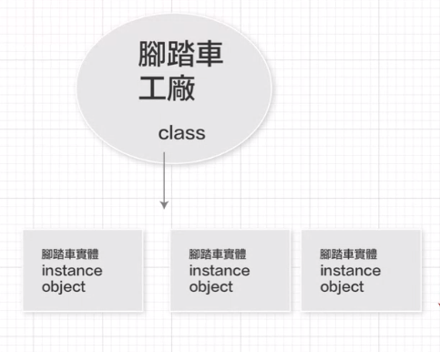

### function的使用：程序導向的設計
- 程序導向優點：效能高、檔案小、是直接針對想要的功能寫的
- 手機裡面的硬體、韌體都是用C寫的(相機驅動等等)
- 讓主程式變簡單，控制程式的流程
- 當主程式遇到fun1＞跑去執行fun1＞結束後回傳結果給主程式＞釋放出記憶體
- fun只有執行時占用記憶體，回傳出結果後就會釋放記憶體
- 但當你的fuction越用越多，你主程式有bug的時候會很難找
- 當你完成之後要新增功能，會很困難 or 會影響到其他區塊的功能設定(牽一髮而動全身)
- 實務上大家會做很多分支&共同開發

### 現在主流的：物件導向
- 像java就是物件導向
- 物件導向優點：你玩的遊戲基本上都是物件導向，隨便用for迴圈出現好幾萬個怪獸

- python同時可以寫程序也可以寫物件導向

### 嘗試自己建class
- 建立class第一個字建議要用大寫
- 自訂class一定要有init(initalizer型別)，如果你沒寫的話會有預設的實體
- 自建的class，會傳出一個實體，需要一個變數去接收實體(p1)
- 得出的__main__.代表：這份主文件(你建立實體的位置)
- 實體的好處：可以儲存「一組」相關資料(attribute屬性)，包含好幾個變數
- Python可以動態建立attribute屬性：用點運算子
- 如果你沒用class，你會需要創好幾百個變數麻煩死
- 一個class可以建立多個實體(p1, p2...等)