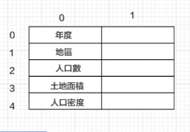

- 講義

1. [老師的repo](https://github.com/roberthsu2003/pythonWindow/tree/master/%E5%88%9D%E8%A6%8Btkinter)

2. [說明文件](https://anzeljg.github.io/rin2/book2/2405/docs/tkinter/index.html)

3. [tkDocs](https://tkdocs.com/tutorial/index.html)

4. [tkinter tutorial](https://www.pythontutorial.net/tkinter/)

5. [友善的教學網站](https://steam.oxxostudio.tw/category/python/tkinter/start.html)

- 若是要跟使用者互動，會有幾種方式：
    1. 視窗：tkinter可以支援python、linux、java(要灌jem)、c++、c#
    2. 網頁：一定要連網路，會有資安跟連線風險，上述的軟體也都可以寫網頁
    3. 手機
        - 安卓(java語言)
        - ios(swift*?)

- 視窗話其實用物件導向(class)、程序導向(function)的寫法都可以，老師的寫法會用物件導向的方式教學

- java寫的程式不能再ipad裡用
- tkinter使用在哪裡？各種工具、機器會需要控制面板

#### tkinter工具箱的呼叫

- tkinter是一個package，裡面有很多模組
- 不用另外幫他寫class，你用它內建的class就可以
- 不建議這種呼叫方式，命名容易會出現衝突

```
from tkinter import * (從tkinter裡面拿出__工具使用，*代表全部)
from tkinter import ttk
```

- 老師建議的寫法如下(幫tkinter工具箱取一個小名)

```
import tkinter as tk
```

##### 建立視窗
```
def main():
    window = tk.Tk()
```
- 建立一個window實體，呼叫tk工具箱裡的Tk內建class

```
window.title("這是第一個視窗") 
```
- 幫我的視窗設定一個名字

```
window.mainloop() 
```
- 讓視窗在主程式一直執行不要結束
- 直到等待使用者的下一個動作
- 使用者關閉視窗才會停止運作，這一定會寫在最後面

#### tkinter工具箱：Tk(簡單建立一個視窗)

#### tkinter工具箱：Label(控制視窗按鈕的外觀)


- 舊：Label
    1. 要使用 tk.Laber (tk是我一開始幫他取的小名)
    2. [說明書](https://www.pythontutorial.net/tkinter/tkinter-label/)
- 新：有新創一個資料夾叫ttk，裡面有放Label
    1. 要使用的話要用from tkinter import tkk (呼叫裡面的這個工具就好)

#### 嘗試用舊的方式寫(tk.Label)

```
label = tk.Label(parent, option, ...)
```
- parent：你要放在什麼物件視窗裡面？
- options：很多的小工具，可以用引數名稱呼叫，預設值都是None
- widget：是一個小工具的意思

```
    label = tk.Label(window, text = "Hello!", font=('Helvetica', '30'))
    label.pack(padx=100, pady=50) 
```
- 先創一個叫label的元件來裝我的內容跟設定，再透過label.pack()控制版面內容
    - text = '文字內容'
    - font = ('字體', '字體大小')

#### pack()佈局/控制版面

[講義說明](https://steam.oxxostudio.tw/category/python/tkinter/pack.html#a3)

- 使用tkinter時會先用pack()控制版面，內建有很多方法可使用
- 有點類似用html的css設定
- padx = 類似padding，labe元件跟視窗左右的寬
- pady = labe元件跟視窗上下的寬
- (網路上有ipadx跟ipady的寫法，建議不要用，之後會被淘汰)

(以上都是程序導向的寫法)

### tkinter的一些設定
- 物件.configure(background='black') 設定視窗背景色
    - 寫bg也可以
    - 顏色可以用十六進位寫
    
    [顏色網站](https://nipponcolors.com/#seiheki)

- tk.Frame() 在視窗中創造一個容器 *這是tk內建的方法
    - ttk.Frame()也可以，但它換被景色的設定比較麻煩，先跳過(有點像css的寫法)
    - Frame有預設的背景色
    - Frame沒有預設大小：當你沒有特別設定大小的時候，它會被裡面放的東西(Label)設定的大小撐開

- tk. StringVar() 設定動態文字(再設定list跟按鈕時需要)
    - 變數是字串使用：tk.StringVar()
    - 變數是整數使用：tk.IntVar()
    - 變數是小數點使用：tk.Double()
    - 抓取動態變數使用：變數.get()
    - 設定動態變數使用：變數.set(字串)
    - 使用者按下時可呼叫方法：command

    


- Listbox.curselection() 取得目前 Listbox 的選項
```
Listbox.curselection()
```
- 我的Listbox裡面，被使用者點選了哪一個，可以回傳給我
- Listbox.curselection() 回傳的變數型態是 tuple
- 例如：如果選擇了第一個選項會得到 (0,)
- 如果是複選會是(0, 1, 3)
- 如果都沒有選擇的話會得到一個空的tuple()
[補充](https://shengyu7697.github.io/python-tkinter-listbox/)


