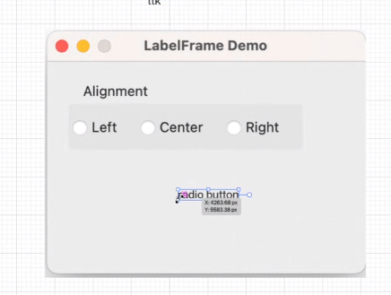
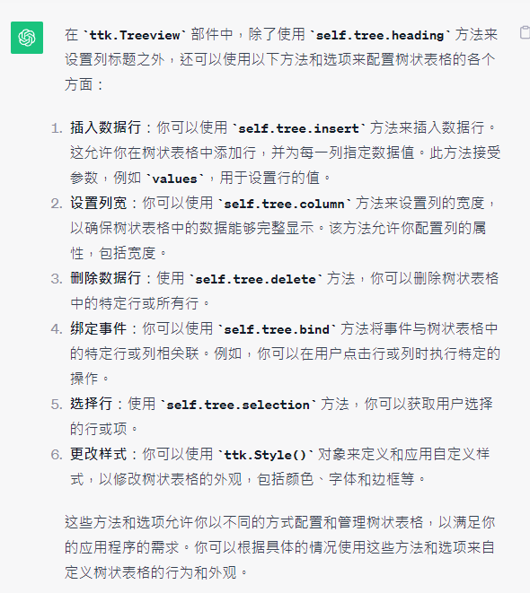

#### tkinter
##### tk.geometry('wxh±x±y') 
- 設定視窗大小，用字串呈現
- geometry='120x50-0+20' *視窗開啟時往右偏移0、往下偏移20px
    - x+0是在左上角，x-是在右上角
##### self.configure(background='') 設定背景色 
##### self.pack(expand=1, fill='both') 
- expand擴充(0&1 or True&False) 
- fill填滿(x左右、y上下、both全部)
##### def __init__(self, master, **kwargs): 
- 預設master:MISC|None ->代表這個容器要放到哪個父容器裡面(預設值是None，改寫預設值，我要放到Window這個視窗裡面)
- **->引述名稱+引數值
##### tk.canvas 繪製圖形
-  canvas.create_line(15, 30, 200, 30) 
    - 畫一條直線，起點為(15,30)，終點為(200,30)
    - 因為y是一樣的，所以會是一條水平線
- canvas.create_line(300, 35, 300, 200, dash=(4,2))
    - dash = (4,2) 
        - 第一個整數表示虛線段的長度（像素數）
        - 第二個整數表示虛線間隔的長度（像素數）

##### rdio button三選一

#### style and theme
[講義](https://tkdocs.com/tutorial/styles.html)

- s = ttk.Style() 
- s.theme_names() 查詢ttk總共有哪些樣式名稱？
- s.theme_use() 查詢我現在用的樣式名稱
- s.theme_use('themename') 修改為指定的樣式名稱

[其他線上可下載的樣式資源](https://wiki.tcl-lang.org/page/List+of+ttk+Themes)

#### ttk.treeView()
- w = ttk.Treeview(parent, option=value, ...)
- parent = 父容器＞代表我在哪裡創建treeView，在class裡面就會是self
- option=value[字串] 樹狀表格欄位的標示符號(e.g. #1、#2、#3 ／ #name、#age、#email)

