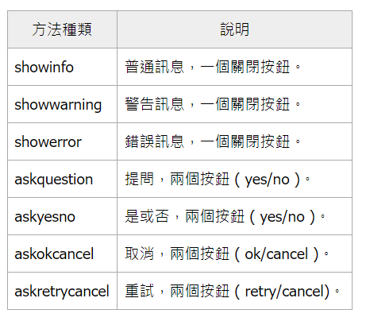

#### tkinter resizable(固定視窗大小)
- 視窗物件.resizable(width=False ,height=False) 
    - 預設值為None，True：可以讓人拉大或拉小 ／ False：固定視窗大小不讓人拉大或拉小

#### self.destroy() #自動關閉視窗

#### tkinter messangebox
[參考說明](https://steam.oxxostudio.tw/category/python/tkinter/messagebox.html)

