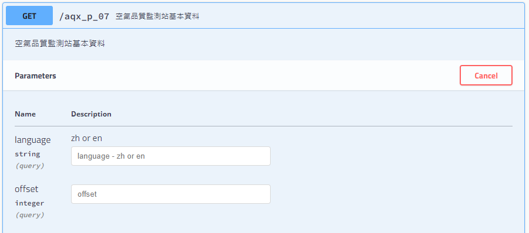

1. 下載環境部空氣品質即時資料[下載連結](https://data.moenv.gov.tw/api/v2/aqx_p_07?api_key=133f5725-c027-46fd-9aca-d97096ead024)

2. 用Python把資料匯入SQLite
3. 設定資料每小時自動更新下載及寫入
4. 設定視窗關閉後後台不再跑

[基隆市資料每小時更新](https://data.moenv.gov.tw/api/v2/aqx_p_135?api_key=133f5725-c027-46fd-9aca-d97096ead024)