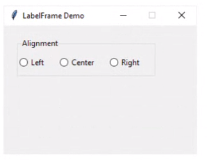

Timer()會在背景自動更新，如果要停止，要寫t.canel()強制關閉，tkinter也有內建的同樣工具after


- Recursion遞迴：自己的def裡面又呼叫自己
- [參考](https://medium.com/ccclub/ccclub-python-for-beginners-tutorial-11ed5d300d3d)

#### SQLite語法(在視窗中按執行SQL)
- 查詢指定欄位，並省略不重複的資料

```
SELECT DISTINCT 站點名稱
FROM 台北市youbike
```

- 查詢指定欄位中最新資料
```
SELECT 站點名稱,MAX(更新時間) AS 更新時間,行政區,地址,總車輛數,可借,可還 
FROM 台北市youbike
GROUP BY 站點名稱
```
- 把資料庫資料用Python讀取，並透過tkinter匯入視窗中
    1. 建立datasource.py，確定資料庫下載+定期自動更新的function
    2. 建立資料庫SQL語法
    3. 建立視窗&樹狀表格

- ttk.LabelFrame() 


- 哪些可以直接pack，哪些不行？

- Frame元素，預設底下會有一個畫布，Frame會因為內容大小而被撐大，但我在沒有內容的時候可以先用expand=True(0)，把我的畫布先擴展，未來內容才可以占滿視窗，畫布是看不到的東西，但我擴展之後，我就可以把我的內容在畫布內靠左靠右排版(e.g. fill=x)


- layout有三種
    1. pack
    2. grid(適合表格資料)
    3. place(可以前後重疊)