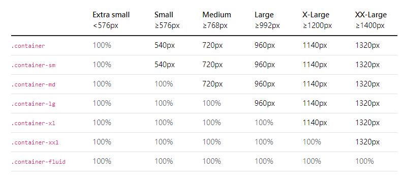
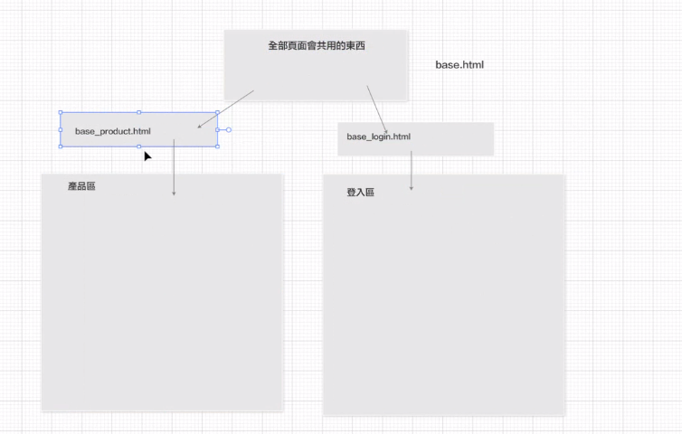

1. 建立app or main連線、透過終端機運行
2. 建立static靜態網頁，裡面有css、js、images
3. 建立templates樣板網頁，記得main頁面也要註冊
4. 可以單獨把Flask_dash_web資料夾上傳到render，外面的檔案為上傳前測試內容用的(跟ipynb意思一樣)
5. 把要上傳的資料夾另開視窗，如果你要測試上傳後的效果，就去另外的視窗先把commit上傳

- index的網頁可以不一定要繼承base，可以先寫一個導覽列的樣板繼承base，並加上導覽列的設定，index在繼承它，這樣你就會有一個包含導覽列的base.html可以用，好處是你之後寫主導覽列不用一直改base。
- 同樣的概念，之後也可以有專屬於產品的樣板、專屬於登入的樣板，他們均繼承於base後加入各自類別獨特的功能後提供大家繼承

### Dash套件應用
[文件](https://dash.plotly.com/minimal-app)

- 複製A Minimal Dash App程式碼，放到一個全新的py檔，透過終端機執行py檔，就可以開啟網頁

- 要改jinja的東西，用flask run可以看到html的即時更新
- 要改dash的東西，用python main.py直接執行，但它就不能直接看到更新

[參考講義](https://github.com/roberthsu2003/python_dash_plotly)

- 套用Dash的寫法加入html的內容
- 在assets加入css跟js的設定

[環境變數設定](https://www.youtube.com/watch?v=KzDpfLdJo7U)