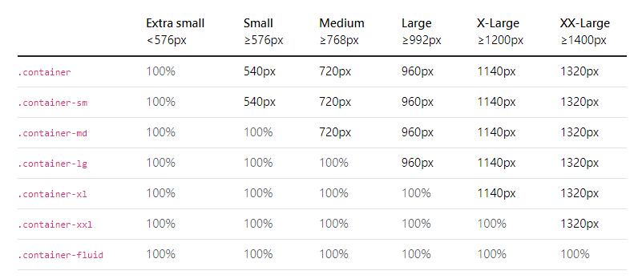

1. 建立app or main連線、透過終端機運行
2. 建立static靜態網頁，裡面有css、js、images
3. 建立templates樣板網頁，記得main頁面也要註冊
4. 可以單獨把Flask_dash_web資料夾上傳到render，外面的檔案為上傳前測試內容用的(跟ipynb意思一樣)
5. 把要上傳的資料夾另開視窗，如果你要測試上傳後的效果，就去另外的視窗先把commit上傳
