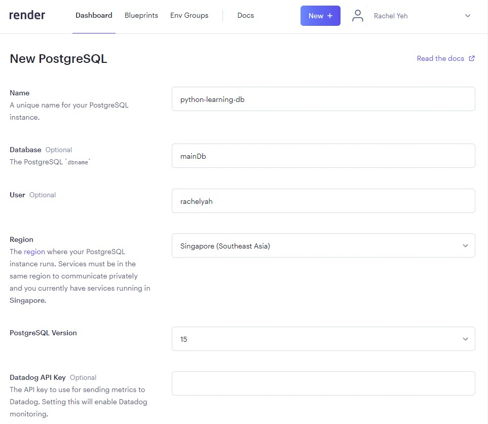

- 線上的資料庫服務，最大的是aws(可以考證照)，其次是微軟，才是google

- 雖然各介面不盡相同，但都是抓取GitHub的repo資料，如果真的出事了，可以再重新透過repo抓取建立

- 通常一個sql server有：
    1. 位置
    2. udername
    3. password
    4. database_name

- 步驟
    1. rendre dashboard → new → PostgreSQL

    2. (Redis也是可以跟PostgreSQL相容使用，它是NOSQL，只能存在記憶體or儲存成本地檔案，在記憶體裡面使用很快，但不能使用太過大量的資料，像電商網站都會兩個資料庫通用，把網頁資料存在PostgreSQL，但會把比較多人看的資料存在記憶體Redis，之後如果大量的人湧入看資料，就會先從記憶體看，不會直接連到資料庫造成太多負擔)

    3. 

    4. datadog的功能可有可無，就是監測database的一些用量資料

    5. maindb必須要全部小寫，之後按下建立即可

    6. 下載pgAdmin4管理軟體

    7. severs右鍵 → register → 與Render的資料庫連結

    8. 在Render的資料庫裡面找到 External Database URL，他的這串網址是用這些訊息組成：
        - postfres：//username：password @ 網址 / database_name
    
    9. 在General輸入Name=render，Connection依序輸入上面的代碼，資料庫就會連接成功

    10. 在mandb按右鍵 → CREATE Script 找到輸入sql語法的地方

    11. 輸入建立表格的語法，注意與先前sqlite的語法有小地方不同：(id的自動更新是SERIAL)，每一個資料庫的SQL語法大致相同
    ```
    CREATE TABLE IF NOT EXISTS 台北市youbike(        
            "id"	SERIAL,
            "站點名稱"	TEXT NOT NULL,
            "行政區"	TEXT NOT NULL,
            "更新時間"	TEXT NOT NULL,
            "地址"	TEXT NOT NULL,
            "總車輛數"	INTEGER,
            "可借"	INTEGER,
            "可還"	INTEGER,
            PRIMARY KEY("id"),
            UNIQUE(站點名稱,更新時間)
        ); 
    ```
    12. 建立datasource.py，將方法寫入，包含：
        - __download_youbike_data()：至指定網址下載資料，並回傳json檔
        - __create_table(conn)：建立資料表&欄位(必須傳入conn連線)
        - __insert_data(conn,values:list[any])寫入資料，並設定更新資料內容若與唯一值相同，則不寫入這筆資料


    