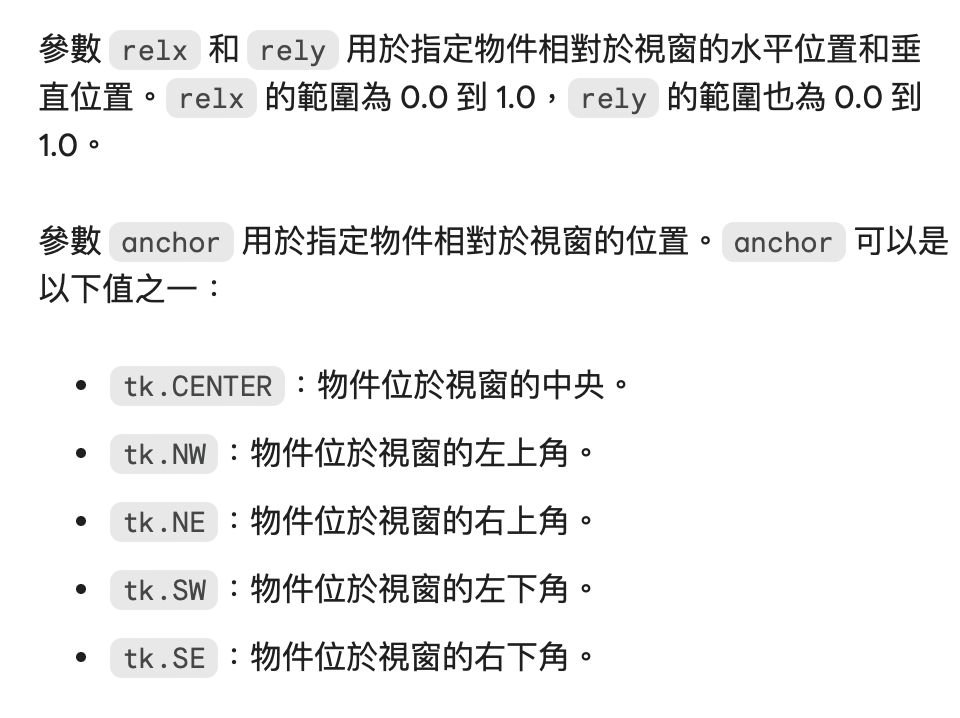

### statistics 函數運用
#### statistics.multimode(data) 求眾數
回傳一個 list，求出List中出現最多次的數字，如果有多個眾數會回傳多個結果;如果是空的會回傳空的List
```
multimode('aabbbbccddddeeffffgg')
['b', 'd', 'f']
multimode('')
[]
```

### 內建函式 all
- 計算內部的數值是否為真，你可以寫出一些判斷式，讓他結果出現True or False
- （e.g.數列是否都等同於第一個數字or數值是否大於3）
```
def all(iterable):
    for element in iterable:
        if not element:
            return False
    return True
```

### 補充教材
[逼哩逼哩影片](https://www.bilibili.com/video/BV1LL4y1h7ny/?share_source=copy_web)

### module引用方法
- import 模組
- import 模組 as 新模組名稱
- from 模組 import 模組內方法(不建議 from 模組 import *，易造成名稱衝突)

### enumerate(序列)->自動幫序列裡的內容從0開始編號
- 也可以寫enumerate(序列變數,start=1) ->從1開始編號

### xlwt套件(將python資料存成xls檔)
- xlwt.Workbook：
    1. add_sheet(sheetname, cell_overwrite_ok=False)
        - 新增一個工作表(工作表名稱, 是否可以重複複寫資料=預設為false)
    2. save(filename_or_stream)
        - 將資料存為xls檔案e.g. data.xls(要寫副檔名)
    3. 

- __pycache__是Python執行過程中的一些暫存拉基，不用理會


### 基本程式語言架構(if__name__一定要寫在最下面)
```
def main():
    pass
if __name__ == "__main__":
    main()  
```

- Python是直譯語言，缺點是效能不好，但優點是膠水語言
- 像Java跟會自己把內容先轉化成執行檔，效能會比直譯好一點
- C的效能是最好的
- 學硬體的人會寫甚麼語言？(e.g.控制冷氣機的按鈕)

- 在網頁的網址前面加上site:＞進入google搜尋葉面但我只在這個網站搜尋

#### 建立tkinter地圖視窗
[參考講義] (https://github.com/roberthsu2003/pythonWindow/tree/master/地圖)

- .place() 指定物件layout的方法，可以重點顯示物件
- archor(錨)：指定位置
